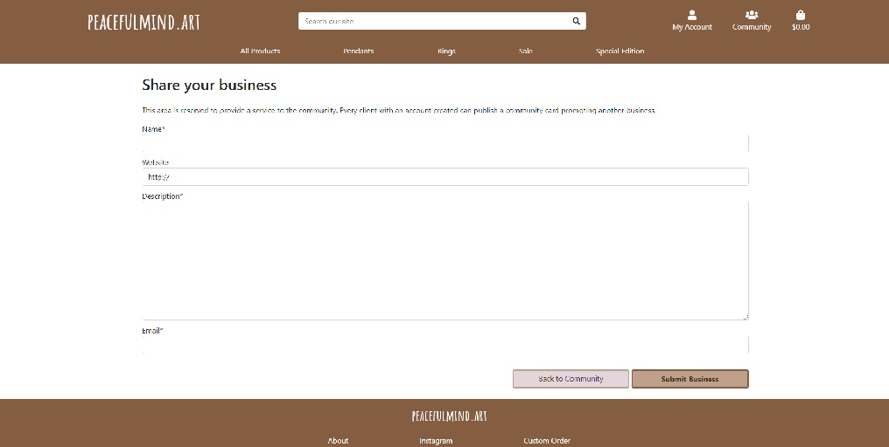

# Peacefulmind.art

This e-commerce platform was was designed and built in order to scale an already existing business. This business is the selling of handmade craft jewelry 
which has been running on Instagram using DMs to complete the sell. The intention is to automate most of the processes and allow the store owner to reach a bigger number of clients
and allow them to make their payments securely and hassle free via Stripe's payment system. With this platform up and running, the store owner only needs to monitor the orders and
post them itself. The platform requests the client to create an account in order to save their details and previous orders so make future purchases more efficient and easy for the client.
Besides the already crafted jewelry, the client has the option to make a custom order also through the platform. The client just needs to fill a form and include their requirements
for a custom made craft jewel.

Besides the business itself, on this platform there's a sub-platform called "Community" that has the goal of helping other small business to exposes themselves and hopefully reach
out to a bigger number of clients. This idea came from the very essence of "sharing is caring" that rules the store owner's life.

A live demo of website can be found [here](###########################).

## UX

THe main users of this platform is everyone who desires to purchase a piece of jewelry which won't be found anywhere else, there's no more exlusive than this.

The navigation is very user friendly, starting with and index page that has all the links displayed and easy to see. On the top bar, on the right, there are the account, community and shopping bag icons
abnd just bellow are the links that divide the entire stock into categories in order to make ir easier for the client to search for exactly what it wants.

The footer allows the client to learn more about the store owner by reading a small biography and checking his intagram page. The custom order link is also in this area.


### User Stories

- As an anonymous user, I want to be able to browse through the whole jewelry stock or browse over just one specific category.
- As an anonymous user, I want to be able to browse through the community in order to check what other business are being marketed.
- As an anonymous user, I want to be able to create my own account and become a registered client.
- As an anonymous user and a registered client, I want to know more about the owner of this store by reading about him and checking social media.
- As an anonymous user and a registered client, I want to be able to submit a custom jewel request. As an anonymous user I want to be able to make this request and possibily receive
a quote before having to commit to registering.
- As a registered client, I want to easily add a desired product to my shopping bag.
- As a registered client, I want to be able to delete a product from the shopping bag.
- As a registered client, I want to be able to save my personal details to use them on my next purchase. Besides this I want to be able to update these details.
- As a registered client, I want to be able to check my previous orders.
- As a registered client, I want to be able to submit a community card in order to share my own or someone else's business.
- As the store owner, I want to be able to manage my products by adding new products, editing or deleting existing ones.
- As the store owner, I want to be able to manage the community cards by deleting the ones I find not relevant.

### Strategy

The goal of this project is to give a chance of this small business to reach out to a bigger number of possible clients. In a world where chain business where everything is standard is the 
norm, causing that everyone has the same clothes everywhere, promoting small and medium businesses should be a priority. Enterpreneurs that use their creativity to make the world an exciting
and diverse place should be praise and supported. 

### Scope

This platform was built with the goal of promoting this small and individual business.

### Wireframes

* Index


* Products List


* Product Details


* Profile Page


* Community Page


* Shopping Bag Page


### Surface

The palette of colors chosen was based on the craftsman's personality.

## DATA

### Databases

Sqlite3 was used during development. For deployment, data tables and data was migrated to a PostgreSQL database.

### Data models

#### Products app

##### Product Model

| **Field**   | **Type**       | **Notes**                   |
|:----------- |:-------------- |:----------------------------|
| category    | ForeignKey     | Category                    |
| sku         | CharField      | Jewel's internal code       |
| name        | CharField      | Jewel's name                |
| description | Textfield      | Jewel's description         |
| material    | CharField      | Materials used              |
| price       | DecimalField   | Jewel's Price               |
| image       | ImageField     | Jewel's image               |

##### Category Model

| **Field**     | **Type**       | **Notes**                   |
|:------------- |:-------------- |:----------------------------|
| name          | CharField      | Category's name             |
| friendly_name | CharField      | Category's friendly name    |

#### Profile app

##### User Profile Model

| **Field**        | **Type**       | **Notes**                   |
|:---------------- |:-------------- |:----------------------------|
| user             | CharField      | User's nickname             |
| phone number     | CharField      | User's Phone Number                |
| street_address1  | CharField      | User's Address                     |
| street_address2  | CharField      | User's Address                     |
| town or city     | CharField      | User's Town or City                |
| postcode         | CharField      | User's Postcode                    |
| county           | ImageField     | User's County                      |
| country          | CountryField   | User's Country                     |

#### Checkout app

##### Order Model

| **Field**        | **Type**       | **Notes**              |
|:---------------- |:-------------- |:-----------------------|
| order_number     | CharField      | Order's Name           |
| user_profile     | ForeignKey     | User's Nickname        |
| full_name        | CharField      | User's Full Name       |
| email            | EmailField     | User's email address   |
| phone_number     | CharField      | User's Phone Number    |
| country          | CountryField   | User's Country         |
| postcode         | CharField      | User's Postcode        |
| street_address1  | CharField      | User's Address         |
| street_address2  | CharField      | User's Address         |
| county           | CharField      | User's County          |
| date             | DateTimeField  | Order's Date           |
| delivery_cost    | DecimalField   | Order's Delivery Cost  |
| order_total      | DecimalField   | Order's Product Cost   |
| grand_total      | DecimalField   | Order's Grande Total   |
| original_bag     | TextField      | Order's Original Bag   |
| stripe_pid       | CharField      | Stripe ID              |

#### Community app

##### Community Card Model

| **Field**        | **Type**      | **Notes**                             |
|:---------------- |:------------- |:--------------------------------------|
| card_number      | AutoField     | Card Number (See note below)          |
| name             | CharField     | Card Name                             |
| website          | URLField      | Business' Website                     |
| description      | TextField     | Small description about the business  |
| email            | CharField     | Business' email                       |
| date             | DateTimeField | Date card was created                 |

Note: This field was created to be used as an argument for the deletion view but then became useless when decided to use the element's ID for it.
The reason why it wasn't deleted was because it was creating some conflicts in the database so I just left this field in.

#### Custom Orders app

##### Custom Order Model

| **Field**        | **Type**      | **Notes**                                |
|:---------------- |:------------- |:-----------------------------------------|
| name             | CharField     | User's Name                              |
| email            | CharField     | User's email                             |
| street_address1  | CharField     | User's Address                           |
| street_address2  | CharField     | User's Address                           |
| town_or_city     | CharField     | User's County                            |
| postcode         | CharField     | User's Postcode                          |
| county           | CharField     | User's County                            |
| country          | CountryField  | User's Country                           |
| date             | DateTimeField | Custom Order's date                      |
| color            | CharField     | Jewel's color                            |
| material         | CharField     | Materials used                           |
| jewel_type       | CharField     | Jewel's Type                             |
| notes            | TextField     | Adittional notes about the custom order  |


### Schema

The database is divided into 3 main components:

- Products
- Community Cards
- Custom Orders

The Products components include 4 databases: User Profile, Products, Category and Order. These 4 databases are the backbone of this whole platform since it provides all the data necessary to display the jewels being sold and then assists with the checkout process are other related processes.
In order to purchase anything the user needs to have a registered profile which is stored in User Profile Model. The Products and Category models are related to each other since every product is required to have a category. 
Community Cards and Custom Orders are separate models which are complementary to the platform. The Community Cards Model is where the business details are stored from the users that want to advertise it while the Custom Orders Model is where the user can submit a request for a custom made jewel for the owner then to see.

Bellow is the graphical representation of my database schema:<br>

<br>

## Existing Features

<ins>Feature 1<ins><br>
- As an anonymous user, I want to be able to browse through the whole jewelry stock or browse over just one specific category.

<br>

<ins>Feature 2<ins><br>
- As an anonymous user, I want to be able to browse through the community in order to check what other business are being marketed.

<br>

<ins>Feature 3<ins><br>
- As an anonymous user, I want to be able to create my own account and become a registered client.

<br>

<ins>Feature 4<ins><br>
- As an anonymous user and a registered client, I want to know more about the owner of this store by reading about him and checking social media.

<br>

<ins>Feature 5<ins><br>
- As an anonymous user and a registered client, I want to be able to submit a custom jewel request. As an anonymous user I want to be able to make this request and possibily receive
a quote before having to commit to registering.

<br>
<br>

<ins>Feature 6<ins><br>
- As a registered client, I want to easily add a desired product to my shopping bag.

<br>

<ins>Feature 7<ins><br>
- As a registered client, I want to be able to delete a product from the shopping bag.

<br>

<ins>Feature 8<ins><br>
- As a registered client, I want to be able to save my personal details to use them on my next purchase. Besides this I want to be able to update these details.

<br>

<ins>Feature 9<ins><br>
- As a registered client, I want to be able to check my previous orders.

<br>

<ins>Feature 10<ins><br>
- As a registered client, I want to be able to submit a community card in order to share my own or someone else's business.

<br>
<br>

<ins>Feature 11<ins><br>
- As the store owner, I want to be able to manage my products by adding new products, editing or deleting existing ones.

<br>
<br>

<ins>Feature 12<ins><br>
- As the store owner, I want to be able to manage the community cards by deleting the ones I find not relevant.

<br>

### Features Left to Implement

The payment flow is still in test so no actual payment is submitted, for this platform to go live this must go live too.

### Known Bugs

Below is a list of bugs/things that are not working correctly that were detected. These weren't corrected due to lack of time from the developer's side so they are flagged here.

The Sort dropdown in the product pages is not working. The option are correctly displayed in the dropdown but does nothing when one of them is selected.
After doing the checkout it displays the order in duplicate. 

# Technologies Used

- Programming Languages
    - HTML
    - CSS
    - JavaScript
    - Python
- [Django](https://www.djangoproject.com/)
- [Google Fonts](https://fonts.google.com/)
    - Amatic font style was used
- [Font Awesome](https://fontawesome.com/)
- [Stripe](https://stripe.com/en-nl)

# Testing

All the tests done to this website can be found in testing.md.

## Heroku

1.  The first thing was to create a requirements.txt and a Procfile as below:

```
pip3 freeze --local > requirements.txt
echo web: python app.py > Procfile
```

2.  Once these files were sucessfuly created I navigated to [Heroku](https://www.heroku.com/) and logged into my account.
    On the top right side of the screen click on "New" and created a new app.
  
  

3.  Then I had to chose a name for my app, I decided on "peacefulmind-art".
  
 

4.  After creating the app in Heroku installed and imported dj_database_url into the project's settings file and then add the POSTGRES database connection as the default database when in production mode alongside the sqlite database when in development. At this point psycopg2 was also installed.

After installing these two I ran pip3 freeze in order to update requirements.txt

 

5.  A new superuser had to be created so ran the command:

```
python3 manage.py createsuperuser
```

For review purposes here's the credential of this superuser

```
username: superuser
password: superuser
```

6.  With the superuser created installed gunicorn before creating a Procfile.

```
pip3 install gunicorn
```

7.  Temporarily disabled COLLECTSTATIC in the Heroku CLI by setting it to -1.

8.  Set up the ALLOWED_HOTS in setting.py in order to allow Heroku's hostname.

9. Set up config variable SECRET_KEY.

10. Set up automatic deployments in Heroku by connecting to the Lionize github repo.

 

11. Enable automatic deploys by selecting the master branch.

 
