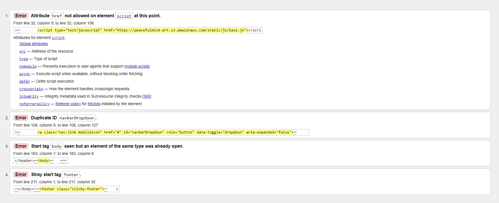

# Peacefulmind-art - Testing Details

[Main README.md file](README.md)

[Github repository](https://github.com/Claudio-C-Santos/MS4-peacefulmind.art)

## Code Validation

- [W3C HTML Validation Service](https://validator.w3.org/)

Four minor errors were detected by the validator.

 

- [W3 CSS Validation Service](https://jigsaw.w3.org/css-validator/)

The base.css file was validated via Jigsaw's validation service and it showed no errors were found being certified by the icon below.

    

- [JSHint](https://jshint.com/)

All JavaScript files were validated no errors were found.

- [PEP8 Online](http://pep8online.com/)

All Python files were validate and not significant errors were detected.

## Testing User Stories from UX section of README.md

For these tests please remit to "Features" section on [README.md](README.md). In that section, there are screenshots with demonstrations on how to use each feature.

## Manual testing of all elements and functionalities throughout the Website

The app has been tested by friends and family who opened the app on different screen sizes like mobile phones, tablets and laptops. The tests were done using Chrome, Firefox and Edge.

## Application Testing

1.  All the pages are responsive according to the screen they are being viewed on.

2.  Registration Page:
    - The user can create its own account by inserting their email address, username and password.
    - If the user uses an email address or username that has already been created, a error message is displayed notifying the user.
    - The form validates if email address has @ symbol.
    - The form validates if the username has 8 or more characters.
    - The form if the password contains 8 or more characters and checks if it's too common.
    - Provides a link directly to the login page in case the user has already registered its account.

3. Login Page:
    - Doesn't allow a user to login without registered credentials.
    - Provides a link directly to the registration page.

4. Products Page:
    - The products will be displayed according to the category selection on the navigation bar.
    - When a product is selected, if the user has a normal account the only options will be to go back to the product list of add the selected product to the bag however if the user is a superuser two extra buttons are displayed, Edit and Delete product.

5. Profile Page:
    - The option to access the profile page is only displayed when the user is logged in.
    - The profile page allows the user to change its own information and see previous orders made with its username.
    - The logged in user can see each order details.

6. Community Page:
    - If the user is not logged in it can only see the available cards.
    - If the user has a "normal" account and is logged in then the option to add a community card is displayed.
    - If the logged in user is a superuser then a button to delete cards is displayed.

7. Product Management Page:
    - This form is only available for superuser.
    - The Category field is a dropdown with a restricted list.
    - The Price field only allows to input numbers.
    - The Cancel button works fine by bringing the user back to the main page.
    - The Add Product button creates the new product which is then displayed in the related product page.

8. Custom Order Page:
    - The form has mandatory fields marked with a * and won't allow the form to be submitted without these inputs.
    - The Country field has a dropdown field displaying all the available countries. 
    - The Jewel type field is a dropdown with a limited list of options.
    - The Back button brings the user back to the main page.
    - The Submit Order button creates a new custom order which is then displayed only for the superuser.
    - The superuser has an option in My Account that is only displayed when superuser is logged in.

9. Shopping Bag Page
    - Any user can fill its shopping bag.
    - If a user is not logged in and click on Checkout it's redirected to the login page.
    - The Delete button removes the related product from the bag.
    - When a registered and logged in user clicks to Checkout the details are automatically filled with the info on Profile Page.
    - The products display correctly with the respective Delete button.
    - When Payment details are correctly filled in the order is completed and a overview is displayed. At the same time an email is sent to the user's email address.

10. When a user wants to log out, under My Account there's a button Logout which redirects the user to a page asking the user to confirm it wants to log out.

